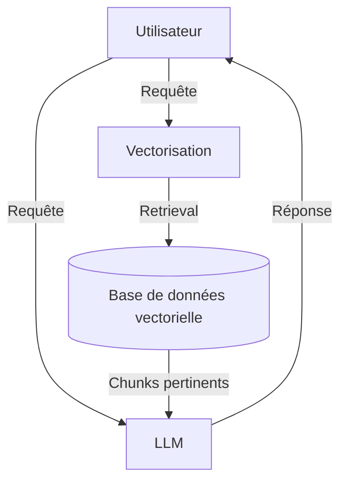
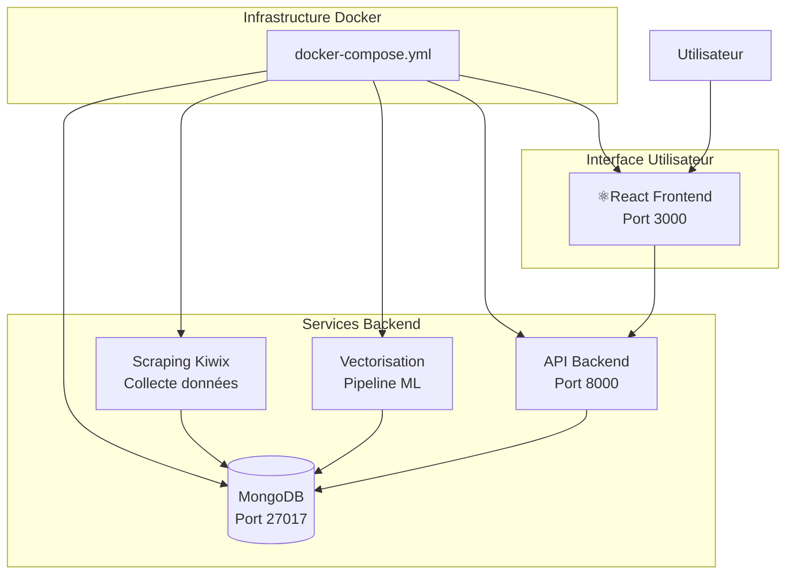

# ChatBot Juridique

> Un assistant conversationnel intelligent spécialisé dans le domaine juridique pour les Junior Entreprises, utilisant l'architecture RAG (Retrieval-Augmented Generation) pour fournir des réponses précises et contextualisées.

## Site en production

Le site est accessible à l’adresse suivante : [badinter-projet.epfprojets.com](https://badinter-projet.epfprojets.com)

## Table des matières

- [Aperçu du projet](#aperçu-du-projet)
- [Architecture](#architecture)
- [Démarrage rapide](#démarrage-rapide)
- [Repositories](#repositories)
- [Documentation](#documentation)
- [État de l'art](#état-de-lart)

---

## Aperçu du projet

### Contexte et motivation

Le domaine juridique nécessite un accès rapide et précis à l'information. Notre ChatBot juridique vise à automatiser les tâches répétitives et à faciliter l'accès aux ressources juridiques.

### Objectifs

#### Fonctionnels
- Réponse automatique aux questions juridiques fréquentes
- Recherche et extraction d'informations dans les documents juridiques
- Orientation vers les textes appropriés
- Explication de procédures et termes juridiques

#### Non fonctionnels
- **Simplicité** : Interface intuitive et accessible
- **Sécurité** : Protection des données sensibles
- **Scalabilité** : Capacité à traiter un grand volume de requêtes
- **Fiabilité** : Réponses précises et vérifiées

---

## Architecture

### Fonctionnement du RAG

### Architecture globale

L'application suit une architecture microservices orchestrée par Docker Compose :

---
## Repositories

## Repositories

| Repository | Description | Technologies | Status |
|------------|-------------|--------------|--------|
| **[legal-chatbot-front](https://github.com/epf-projet-chatbot/legal-chatbot-front)** | Interface utilisateur | React, TypeScript, Tailwind |  |
| **[api](https://github.com/epf-projet-chatbot/api)** | API | FastAPI, Python |  |
| **[vectorisation](https://github.com/epf-projet-chatbot/vectorisation)** | Gestion des données et vectorisation | Python, MongoDB, HuggingFace, Embeddings |  |
| **[rag](https://github.com/epf-projet-chatbot/rag)** | Vectorisation et pipeline RAG | Python, ChromaDB, API Gemini |  |
---

## Etat de l'art

- Travaux existants
    - Chatbots
    - Pipelines
    - Techniques utilisées (Ex: arbre de décision)

### Spécificités des chatbots juridiques (legalbots)
Les chatbots juridiques, représentent une application particulièrement prometteuse de l’IA conversationnelle dans le secteur du droit. Leur état de l’art en 2025 se caractérise par :

1. Automatisation des tâches simples et répétitives

Les legalbots répondent instantanément à des questions juridiques fréquentes, orientent les utilisateurs vers les textes de loi appropriés, expliquent des procédures ou des termes juridiques, et allègent la charge des juristes sur les tâches basiques.

Ils sont utilisés aussi bien en interne (cabinet d’avocats, directions juridiques) qu’en externe (sites web, portails clients).

2. Intégration de modèles avancés (GPT-4 et suivants)

Les legalbots s’appuient sur les modèles de langage les plus récents, capables de réussir des examens professionnels (comme le barreau), garantissant ainsi la qualité et la pertinence des réponses fournies.

Ils peuvent analyser et extraire des informations de documents juridiques complexes (contrats, décisions de justice), facilitant la gestion documentaire à grande échelle.

3. Personnalisation et contextualisation

Certains chatbots juridiques sont conçus pour interroger des bases de données spécifiques (par exemple, tous les articles d’un site juridique ou les forums d’une communauté d’experts), offrant des réponses contextualisées et fiables.

Ils valorisent l’expertise humaine en relayant les questions complexes vers des professionnels, tout en automatisant le tri et la première analyse des demandes.

4. Limites et complémentarité

Les legalbots ne remplacent pas l’expertise humaine pour les situations complexes ou nécessitant une interprétation subtile du droit. Ils servent d’assistants, accélérant l’accès à l’information et la préparation des dossiers, mais la validation finale reste du ressort du professionnel.

5. Exemples d’usages concrets

Assistance à la conformité (compliance), due diligence lors de fusions-acquisitions, analyse de risques, recherche de clauses spécifiques dans des contrats, aide à la rédaction de documents juridiques standards.

Aide à la compréhension du RGPD, de la fiscalité, du droit des sociétés, du droit de la famille, etc., pour les particuliers comme pour les professionnels.

### Exemples

[law.co](https://law.co/) : S'appuie sur le modèle GPT-4 pour aider les personnes travaillant dans le domaine légal à générer leurs documents.

[rasa](https://github.com/RasaHQ/rasa) : Un chatbot opensource 

[wit.ai](https://github.com/wit-ai) : Outil opensource de création et d'entraînement de chatbots disponible en Node.js, Python, Go, Ruby et Unity
